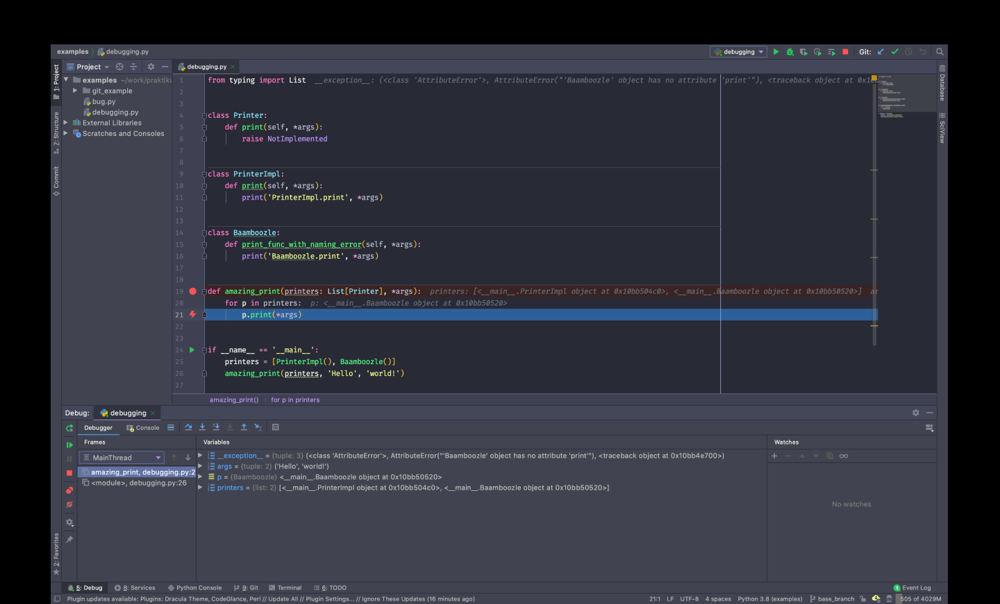
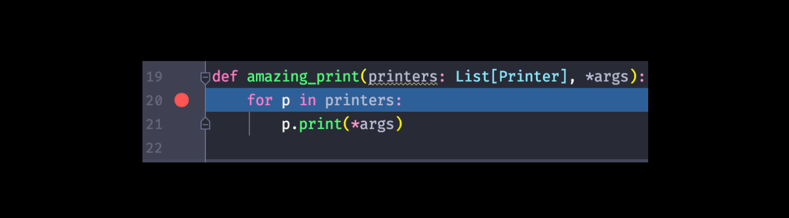
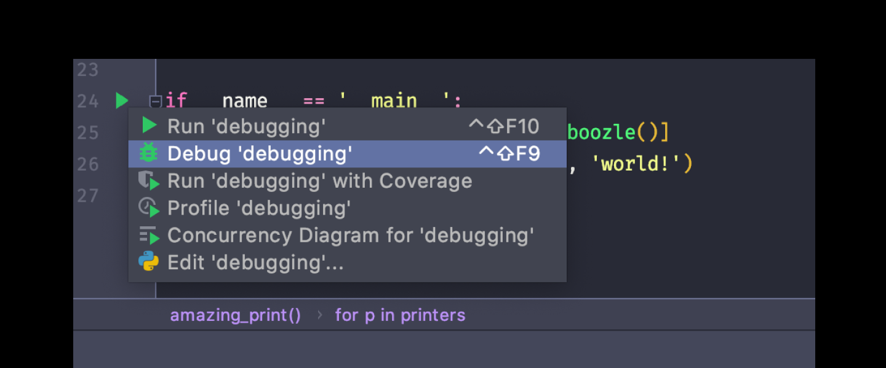
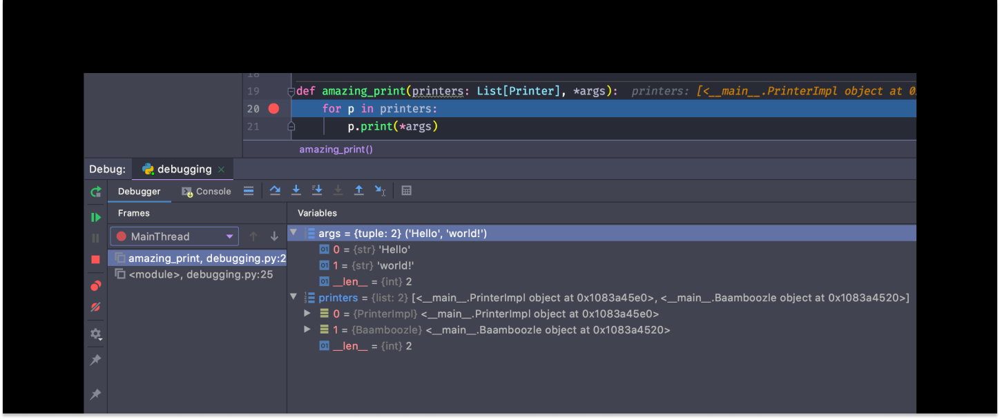
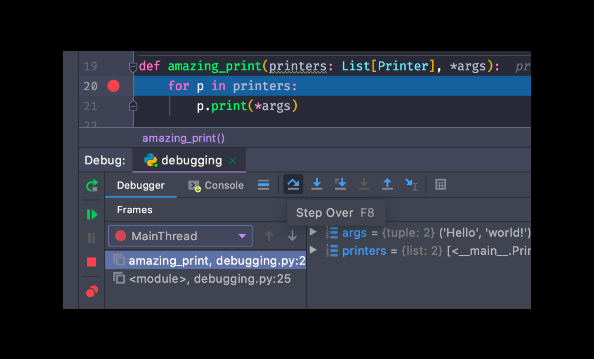
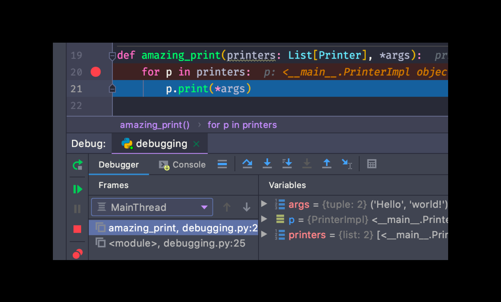
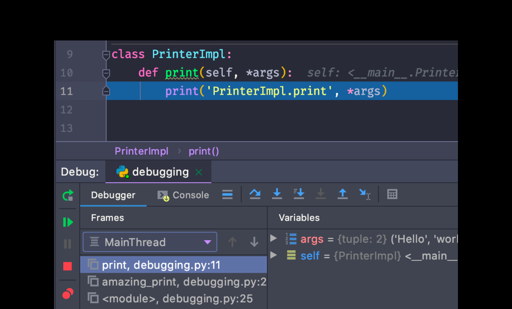

### Отладчик в PyCharm

IDE PyCharm — это среда разработки, где есть встроенный дебаггер. В PyCharm не нужно менять код программы, чтобы установить брейкпоинт: достаточно поставить точку на нужной строке кода, и программа приостановит свою работу в этом месте. 

Одно из преимуществ такого подхода — установка точки во внешней библиотеке. В случае дебаггинга с помощью ipdb ****или принтов так сделать сложно.

Чтобы лучше разобраться в дебаггере, изучите его [документацию](https://www.jetbrains.com/help/pycharm/debugging-code.html) на английском.

Рассмотрим отладку в PyCharm:

Для начала установите точку, чтобы отладчик остановился в нужном месте программы:

Для запуска отладчика нажмите на кнопку Debug**.** Она находится в контекстом меню запуска программы. Контекстное меню вызывается нажатием на зеленый треугольник напротив строчки `if __name__ == '__main__'` :

После запуска отладчик остановится на первой точке**,** которая встретится по ходу выполнения программы. После этого появится окно с отладочной информацией. В нём вы увидите переменные в области видимости и текущий фрейм:

В окне отладчика есть панель управления. На данный момент вам нужны только две кнопки:

- перейти на следующую строчку — step over;
- «провалиться» внутрь функции на текущей строке — step into.

Первая кнопка позволяет перейти на следующую строчку программы. Исходная позиция:

Результат после нажатия кнопки:

Вторая кнопка позволяет «провалиться» внутрь функции. В данном примере вы «провалитесь» внутрь метода `print`. До нажатия кнопки окно отладчика выглядит так:

Результат нажатия кнопки:

### Отладка кода на удалённом сервере

В PyCharm можно запустить отладчик на удалённом сервере. Это удобно, если баги появляются только на сервере, а отлаживать принтами нет времени и желания. 

Несмотря на то, что подобные ситуации встречаются редко, изучите [инструкцию по удалённому дебаггингу на английском](https://www.jetbrains.com/help/pycharm/remote-debugging-with-product.html). 

Но не стоит надеяться, что при появлении ошибок вам разрешат подключиться к prod-серверу с помощью дебаггера — у каждой компании своя политика безопасности. Помните: нет доступа — нет дебаггинга.

Вам пригодится отладка на удалённом сервере, когда вы будете делать сервис авторизации. В вашем распоряжении будет PostgreSQL-сервер с ограниченным доступом в Яндекс.Облаке. Для отладки с боевыми данными придётся настроить интерпретатор на удаленной машине.