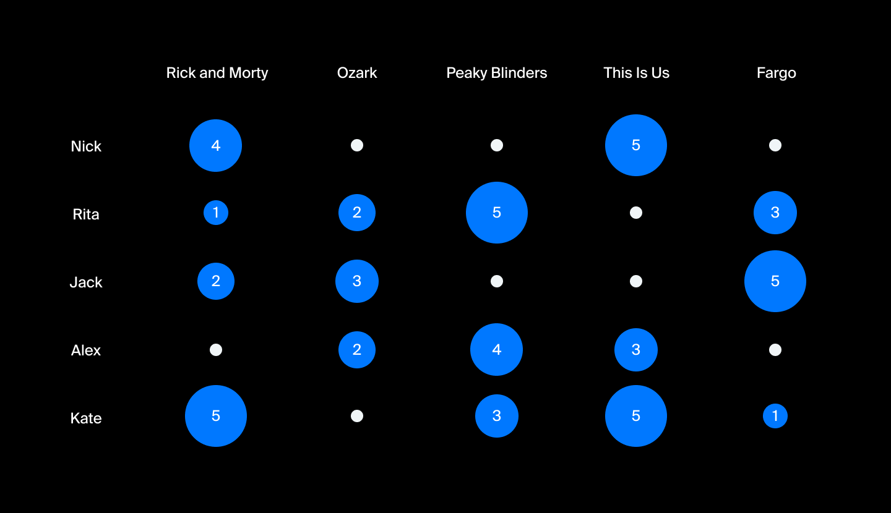

# Практическое задание: поломанные рекомендации

Персонализация онлайн-маркетинга — тренд последнего десятилетия. По оценкам [McKinsey](https://www.mckinsey.com/industries/retail/our-insights/how-retailers-can-keep-up-with-consumers), около 35% выручки Amazon или 75% выручки Netflix приходится именно на рекомендованные товары. Этот процент будет расти. [Рекомендательные системы](https://habr.com/ru/company/lanit/blog/420499/) — это история про то, как сделать клиента счастливым.

В центре любой рекомендательной системы находится так называемая матрица предпочтений. По одной из осей отложены все клиенты сервиса (Users), по другой — объекты рекомендации (Movies). На пересечении некоторых пар User и Movie матрица заполнена оценками (Ratings). Это оценка фильма по заданной шкале, например, от 1 до 5.



Классическая реализация [User-based алгоритма](https://ru.wikipedia.org/wiki/%D0%9A%D0%BE%D0%BB%D0%BB%D0%B0%D0%B1%D0%BE%D1%80%D0%B0%D1%82%D0%B8%D0%B2%D0%BD%D0%B0%D1%8F_%D1%84%D0%B8%D0%BB%D1%8C%D1%82%D1%80%D0%B0%D1%86%D0%B8%D1%8F) основана на принципе ближайших соседей. То есть, алгоритм ищет для каждого пользователя наиболее похожих на него в плане предпочтений. Например, если ваши соседи по интересам в восторге от фильма «[Blade Runner](https://www.kinopoisk.ru/film/403/)», а вы по какой-то причине ещё его не смотрели, алгоритм предложит вам этот фильм к просмотру субботним вечером.

У вас просит помощи коллега из отдела рекомендательных систем. Он написал скрипт для создания двухмерных матриц, но он работает медленно и с ошибками. Из разговора о реализации вы узнали, что:

- есть метод для создания «нулевой» матрицы размером users x movies, заполненной null-объектами;
- функция `__repr__` преобразовывает матрицу в строковое представление;
- если после добавления оценки матрица закончилась, она автоматически масштабируется.

Есть и некоторые особенности добавления оценок в матрицу:

- нельзя добавить null-объект;
- матрица заполняется построчно: с первой до последней строки слева направо.

Когда добавляются данные в последнюю строку или последний столбец матрицы, то её необходимо масштабировать. Масштабирование происходит по определённым правилам: в матрицу добавляют один столбец c `users` и одну строку c `movies`. При этом те оценки, которые уже были добавлены в матрицу, сдвигаются к началу, чтобы между ними не было null-объектов.

## Задание

Код коллеги-аналитика очень медленный и тяжелый для восприятия. Ваша задача —оптимизировать его.  Обязательно сохраните решение, оно ещё вам понадобится.

Отлаживать код лучше всего в IDE, а платформу использовать для проверки решения.

## Прекод

```python
from typing import Optional, List

class Matrix:
    """
    Код нашего коллеги аналитика очень медленный и тяжелый для восприятия. Ваша задача сделать его быстрее и проще.
    """
    def __init__(self):
        self.matrix = [[None]]

    def matrix_scale(self, matrix: List[List[Optional[object]]], scale_up: bool) -> List[List[Optional[object]]]:
        """
        Функция отвечает за создание увеличенной или уменьшенной матрицы.
        Режим работы зависит от параметра scale_up. На выходе получаем расширенную матрицу.
        :param matrix: исходная матрица
        :param scale_up: если True, то увеличиваем матрицу
        :return: измененная матрица
        """
        former_size = len(matrix)
        size = former_size + 1 if scale_up else former_size - 1
        new_matrix = [[None for _ in range(size)] for _ in range(size)]
        linear_matrix = [None for _ in range(size ** 2)]

        # Раскладываем элементы матрицы к «плоскому» массиву
        row = 0
        column = 0
        for index in range(len(linear_matrix)):
            item = matrix[row][column]
            linear_matrix[index] = item

            column += 1
            if column == former_size:
                column = 0
                row += 1

            if row == former_size:
                break

        # Записываем элементы в новую матрицу
        iterator = iter(linear_matrix)
        try:
            for row in range(len(new_matrix)):
                for column in range(len(new_matrix)):
                    new_matrix[row][column] = next(iterator)

        except StopIteration:
            return new_matrix

        return new_matrix

    def find_first_none_position(self, matrix) -> (int, int):
        """
        Находим позицию в матрице первого None-элемента. По сути он обозначает конец данных матрицы.
        """
        for row in range(len(matrix)):
            for column in range(len(matrix)):
                if matrix[row][column] is None:
                    return row, column

    def find_last_not_none_position(self, matrix):
        """
        Находим позицию последнего не None-элемента матрицы.
        """
        for row in range(len(matrix) - 1, -1, -1):
            for column in range(len(matrix) - 1, -1, -1):
                if matrix[row][column] is not None:
                    return row, column

    def add_item(self, element: Optional = None):
        """
        Добавляем новый элемент в матрицу.
        Если элемент не умещается в (size - 1) ** 2, то нужно расширить матрицу.
        """
        if element is None:
            return

        size = len(self.matrix)
        last_row, last_column = self.find_first_none_position(self.matrix)

        if last_row * size + last_column >= (size - 1) ** 2:
            self.matrix = self.matrix_scale(self.matrix, scale_up=True)
            last_row, last_column = self.find_first_none_position(self.matrix)

        self.matrix[last_row][last_column] = element

    def pop(self):
        """
        Удалить последний значащий элемент из массива.
        Если значащих элементов меньше (size - 1) * (size - 2), нужно уменьшить матрицу.
        """
        size = len(self.matrix)
        if size == 1:
            raise IndexError()

        last_row, last_column = self.find_last_not_none_position(self.matrix)
        value = self.matrix[last_row][last_column]
        self.matrix[last_row][last_column] = None

        if last_row * size + last_column <= (size - 1) * (size - 2):
            self.matrix = self.matrix_scale(self.matrix, scale_up=False)

        return value

    def __repr__(self):
        """
        Метод должен выводить матрицу в виде:
        1 2 3\nNone None None\nNone None None
        То есть, между элементами строки должны быть пробелы, а строки отделены \n
        """
        result = []
        for row in range(len(self.matrix)):
            result.append(' '.join(str(x) for x in self.matrix[row]))

        return '\n'.join(result)
```

## Подсказка

1. При расширении матрицы уходит очень много процессорного времени. Подумайте, как можно это исправить.
2. Не обязательно хранить матрицу как массив массивов — упростите себе жизнь.

## Текст успешного прохождения

Поздравляем! Скрипт летает, коллега-аналитик счастлив, пользователи легко находят хорошее кино на вечер.

## Тесты

```python
import threading

def test_add_item_empty_matrix():
    matrix = Matrix()

    matrix.add_item(1)

    expected = '1 None\nNone None'

    assert str(matrix) == expected, f'Expected: {expected}\nActual: {str(matrix)}'

def test_add_item_extend_non_empty_matrix():
    matrix = Matrix()

    matrix.add_item(1)
    matrix.add_item(2)
    matrix.add_item(3)

    expected = '1 2 3\nNone None None\nNone None None'

    assert str(matrix) == expected, f'Expected: {expected}\nActual: {str(matrix)}'

def test_add_item_none_value():
    matrix = Matrix()

    try:
        matrix.add_item(None)
    except ValueError:
        assert True
        return
    assert False, 'Expected ValueError, when None value added'

def test_add_item_without_resize():
    matrix = Matrix()

    matrix.add_item(1)
    matrix.add_item(1)
    matrix.add_item(1)
    matrix.add_item(1)

    expected = '1 1 1\n1 None None\nNone None None'

    assert str(matrix) == expected, f'Expected: {expected}\nActual: {str(matrix)}'

def test_pop_size_1():
    matrix = Matrix()

    try:
        matrix.pop()
    except IndexError:
        assert True
        return
    assert False, 'Expected IndexError, when pop() on empty matrix'

def test_pop_with_resize():
    matrix = Matrix()

    matrix.add_item(1)
    matrix.add_item(2)
    matrix.add_item(3)

    matrix.pop()

    expected = '1 2\nNone None'

    assert str(matrix) == expected, f'Expected: {expected}\nActual: {str(matrix)}'

def test_pop_without_resize():
    matrix = Matrix()

    matrix.add_item(1)
    matrix.add_item(1)
    matrix.add_item(1)
    matrix.add_item(1)

    matrix.pop()

    expected = '1 1 1\nNone None None\nNone None None'

    assert str(matrix) == expected, f'Expected: {expected}\nActual: {str(matrix)}'

def test_pop_several_resizes():
    matrix = Matrix()

    matrix.add_item(1)
    matrix.add_item(1)
    matrix.add_item(1)
    matrix.add_item(1)

    matrix.pop()
    matrix.pop()
    matrix.pop()

    expected = '1 None\nNone None'

    assert str(matrix) == expected, f'Expected: {expected}\nActual: {str(matrix)}'

def test_matrix_speed():
    threshold_seconds = 1  # Очень сильно зависит от платформы (нашли эмпирическим путем)
    signal = threading.Event()
    stop_event = threading.Event()

    def inner():
        size = 100
        operations = 100_000
        matrix = Matrix()

        for i in range(1, size ** 2 - 1):
            matrix.add_item(i)

        for _ in range(operations):
            if stop_event.is_set():
                return
            item = matrix.pop()
            matrix.add_item(item)

        signal.set()

    thread = threading.Thread(target=inner)
    thread.start()

    thread.join(timeout=threshold_seconds)
    if not signal.is_set():
        stop_event.set()
        assert False, 'Код работает медленно'
        return

def main():
    test_add_item_empty_matrix()
    test_add_item_extend_non_empty_matrix()
    test_add_item_none_value()
    test_add_item_without_resize()
    test_pop_size_1()
    test_pop_with_resize()
    test_pop_without_resize()
    test_pop_several_resizes()
    test_matrix_speed()

main()
```

В тестах отсутствует импорт Matrix, так как они должны оказаться на платформе