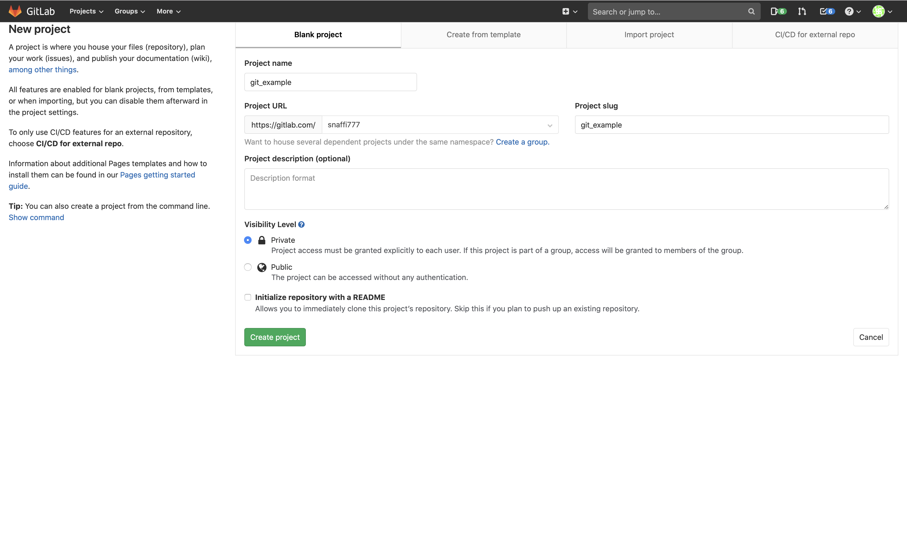

# Git

## Начало

Для базовой работы с Git достаточно консоли и любого текстового редактора: VSCode, Vim, Emacs, PyCharm.

Сначала зарегистрируйтесь на сервисе [GitLab](https://gitlab.com/explore). Он предоставляет бесплатное хранилище для git-репозиториев. Оно нужно для централизованного хранения исходников, чтобы все участники проекта могли обмениваться изменениями. 

Во время работы разработчик заносит изменения в локальный git-репозиторий, а потом отправляет их на git-сервер. После этого другие участники применяют их в своих локальных репозиториях.

Начнём знакомство с Git. [Создадим новый проект](https://gitlab.com/projects/new): 



После создания репозитория есть несколько вариантов инициализировать его через консоль.

**Первый вариант: клонирование репозитория**

```bash
# клонируем репозиторий в текущую папку
git clone git@gitlab.com:snaffi777/git_example.git
cd git_example
# создаём пустой файл README.md
touch README.md
# добавляем файл в репозиторий
git add README.md
# фиксируем изменения в репозитории
# указываем в качестве сообщения краткое описание того, что изменили 
# например, «добавил API регистрации пользователей»
git commit -m "add README"
# отправляем изменения в репозитории на git-сервер (gitlab.com)
# master — это название ветки, куда отправляются изменения
git push -u origin master
```

**Второй вариант: создание репозитория из имеющейся папки с исходным кодом**

```bash
mkdir git_example
cd git_example
# создаём пустой файл README.md
touch README.md
# иницилизируем git 
git init
# указываем git-сервер для репозитория 
git remote add origin git@gitlab.com:snaffi777/git_example.git
# добавляем все файлы в папке в репозиторий
git add .
# фиксируем изменения в репозитории
# указываем в качестве сообщения краткое описание того, что изменили 
# например, «добавил API регистрации пользователей»
git commit -m "Initial commit"
# отправляем изменения в репозитории на git-сервер (gitlab.com)
# master — это название ветки, куда отправляются изменения
git push -u origin master
```

Обновим страничку в GitLab и убедимся, что изменения попали в репозиторий:


Добавим в репозиторий файл main.py:

```python
# main.py

def hello_git():
    print('Hello git!')

if __name__ == '__main__':
    hello_git()
```

Выполним команду `git log --all --decorate --oneline --graph`. Должен отобразиться подобный вывод с историей изменений:

```bash
* c5b9707 (HEAD -> master, origin/master, origin/HEAD) add main.py
* f9573b5 Initial commit
```