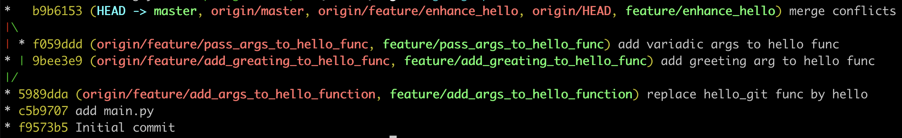

## Конфликты

Бывают ситуации, когда один и тот же файл разработчики одновременно изменили в разных ветках, а при слиянии этих веток происходят конфликты: 

```bash
git checkout -b feature/enhance_hello
git checkout -b feature/add_greeting_to_hello_func

```

Не беда. Вносим изменения в файл, чтобы изменения в другой ветке стали конфликтными:

```python
def hello(greeting: str, name: str):
    print(f'{greeting} {name}!')

if __name__ == '__main__':
    hello('Hello', 'git')
```

Коммитим изменения:

```bash
git add main.py
git commit -m 'add greeting arg to hello func'
git push origin feature/add_greeting_to_hello_func
```

Возвращаемся в предыдущую ветку и создаем от неё дочернюю ветку:

```bash
git checkout feature/enhance_hello
git checkout -b feature/pass_args_to_hello_func
```

Добавляем изменения:

```python
def hello(name: str, *args):
    names = ', '.join([name] + list(args))
    print(f'Hello {names}!')

if __name__ == '__main__':
    hello('git', 'conflicts')

```

Теперь коммитим их:

```bash
git add main.py
git commit -m 'add variadic args to hello func'
git push origin feature/pass_args_to_hello_func
```

Создадим конфликты для проверки:

```bash
git checkout feature/enhance_hello
# сольём первую ветку
git merge feature/add_greeting_to_hello_func
# отправим на сервер
git push origin feature/enhance_hello
# а теперь попытаемся слить вторую ветку
git merge feature/pass_args_to_hello_func
# и тут же получим ошибку
Auto-merging main.py
CONFLICT (content): Merge conflict in main.py
Automatic merge failed; fix conflicts and then commit the result.
# теперь посмотрим на содержимое файла 
cat main.py

#main.py
<<<<<<< HEAD
def hello(greeting: str, name: str):
    print(f'{greeting} {name}!')

if __name__ == '__main__':
    hello('Hello', 'git')
=======
def hello(name: str, *args):
    names = ', '.join([name] + list(args))
    print(f'Hello {names}!')

if __name__ == '__main__':
    hello('git', 'conflicts')
>>>>>>> feature/pass_args_to_hello_func
```

В файле появились непонятные дополнения: 

- `<<<<<<< HEAD`;
- `=======`;
- `>>>>>>> feature/pass_args_to_hello_func`.

Эти строки можно назвать «разделителями конфликта». Строка `=======` — «центр» конфликта. Всё содержимое между строкой `<<<<<<< HEAD` и `=======` находится в текущей мастер-ветке. На неё и указывает ссылка HEAD. А всё между центром и строкой `>>>>>>> feature/pass_args_to_hello_func` — содержимое  той ветки, которую пытаемся слить.

Для решения подобных конфликтов пользуются командой `git mergetool` и запускают программу для слияния. Если такой нет, попробуйте установить [Meld](https://meldmerge.org). Если вы работаете в PyCharm, вызовите из меню инструмент слияния:  VCS → Git → Resolve conflicts. 

Попробуйте решить конфликты самостоятельно. На выходе должна получиться рабочая программа.

В конце в вашей мастер-ветке должен получиться следующий результат:

```bash
python main.py
Hello git, conflicts!
```

Дальше вам нужно:

- закоммитить изменения,
- отправить их на сервер,
- слить изменения с мастер-веткой.

Выведите логи изменений `git log --graph --oneline --decorate`. Получим такой вывод:



В консоли вы увидите древовидную историю в репозитории. В примере видно, в какой момент ветка `feature/pass_args_to_hello_func` была создана от мастер-ветки, и в какое время она была слита в мастер.