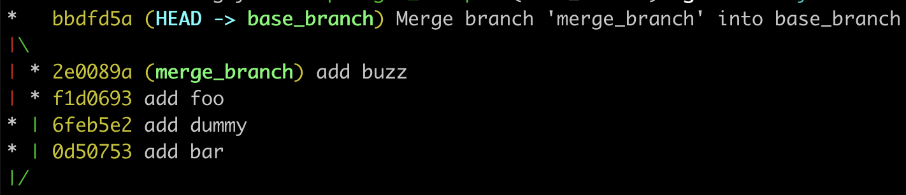
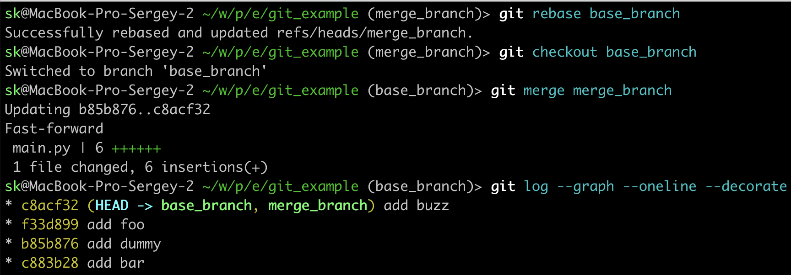

## Rebase

Команда `rebase` создаёт более чистую историю коммитов. Когда разработчик использует только команду `merge`, история выглядит так:



В истории остается ветвление, от которого не так много пользы. Поэтому её можно перенести в master и сделать линейной.

Начнём наводить порядок. Выполним команды:

```bash
git rebase master
git checkout master
git merge feature
```

После них история стала выглядеть так: 



### Rebase с изменением коммитов

Ещё одно преимущество ребейза — одной командой все коммиты схлопываются в один. История становится более чистой, а коммиты с мелкими фиксами или исправлениями комментариев ревьюверов — отсутствуют. 

1. Создайте dev-ветку**.**
2. От этой ветки создайте ветку feature/dev_rebase.
3. В этой ветке несколько раз поменяйте файл main.py и закоммитьте каждый.
4. Зайдите в dev-ветку**.**
5. Модифицируйте файл main.py несколько раз и закоммитьте. 
6. Вернитесь в ветку feature/dev_rebase.
7. Сделайте ребейз на dev-ветку, схлопнув все коммиты в один. Для этого используйте команду `git rebase -i` и следуйте инструкциям. 

Посмотрите на пример работы с ****`rebase -i` для редактирования своих изменений в ветке. Дополнительно, вы получаете новые изменения из мастера. Если ваш коллега добавил новый интерфейс работы с s3 или базой данных, новый код будет доступен в вашей фича-ветке. 

```bash
(venv) ➜ service-etl-search git:(PRK-1-etl-flow) ✗ git checkout master
Switched to branch 'master'
Your branch is up to date with 'origin/master'.
(venv) ➜ service-etl-search git:(master) ✗ git pull
Already up to date.
(venv) ➜ service-etl-search git:(master) ✗ git checkout -
Switched to branch 'PRK-1-etl-flow'
Your branch and 'origin/PRK-1-etl-flow' have diverged,
and have 38 and 22 different commits each, respectively.
(use "git pull" to merge the remote branch into yours)
(venv) ➜ service-etl-search git:(PRK-1-etl-flow) ✗ git rebase -i master
```

Рассмотрим интерфейс работы с редактированием истории в своей ветке:

```bash
reword d12d213 PRK-1-etl-flow: Многопоточность в загрузке данных
fixup 3559f3e PRK-1-etl-flow: fixup! Исправлена ошибка во writers
pick 88541c9 PRK-1-etl-flow: Добавлен интерфейс для работы с БД 

# Commands:
# p, pick <commit> = use
# r, reword <commit> = use commit, but edit the commit message
# e, edit <commit> = use commit, but stop for amending
# s, squash <commit> = use commit, but meld into previous commit
# f, fixup <commit> = like "squash", but discard this commit's log message
# x, exec <command> = run command (the rest of the line) using shell
# d, drop <commit> = remove commit
# l, label <label> = label current HEAD with a name
# t, reset <label> = reset HEAD to a label
# m, merge [-C <commit> | -c <commit>] <label> [# <oneline>]
```

После успешного изменения в вашей ветке, вы можете получить конфликт в `origin`. Чтобы решить его, вам придётся обновить ветку «силой». Рекомендуем использовать `push force`, если вы работаете один в своей ветке, иначе после смены хэша коммитов остальные разработчики получат конфликты. 

```bash
Successfully rebased and updated refs/heads/PRK-1-etl-flow.
(venv) ➜ service-etl-search git:(PRK-1-etl-flow) ✗ git push -f origin PRK-1-etl-flow
```

### Как откатить rebase, если его сделали не от нужной ветки

Попробуйте разрулить следующую ситуацию:

Разработчики создали ветку и закоммитили в неё кучу изменений. Затем сделали ребейз от ветки feature/1. Прибегает тимлид и говорит, что надо было ребейзиться от ветки feature/2.

Один из ключей к решению этой проблемы — команда `git reflog`**.** 

### Недостатки rebase

Из-за того, что ребейз меняет историю коммитов, можно потерять контекст, в котором их написали разработчики. Ещё теряется информация о слияниях веток: она нужна для определения причины ошибки. Помните об этом.