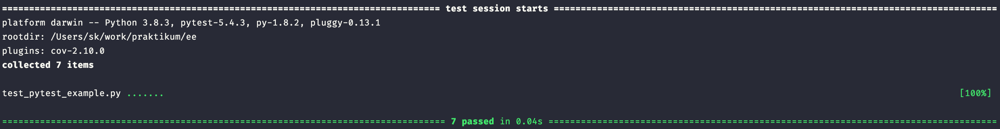

# Разработка тестов с помощью pytest

[Pytest](https://docs.pytest.org/en/stable/) — это фреймворк для написания тестов с помощью которого можно писать лаконичный и декларативный код.

Для установки pytest выполните команду `pip install pytest`.

Рассмотрим небольшой пример на [pytest](https://docs.pytest.org/) и подхода TDD. Создайте файл `test_pytest_example.py`:

```python
from typing import Union

import pytest

# имитация HTTP-ответа
# нужна в качестве примера, к реальной жизни не применима!
class HttpJsonResponseImitation:
    def __init__(self, status: int, payload: Union[dict, list]):
        self.status = status
        self.payload = payload

users = {
    'vasy@example.com': {
        'id': 123,
        'username': 'vasya',
        'password': 'awesome_valid_password',
        'is_blocked': False
    },
    'blocked_login': {
        'id': 456,
        'username': 'petya',
        'password': 'blocked_password',
        'is_blocked': True
    },
}

# тестируемая функция
def login(data):
    errors = []
    for field in ['login', 'password']:
        if field not in data:
            errors.append(f'{field} required')
    if errors:
        return HttpJsonResponseImitation(400, {'error': errors})
    user = users.get(data['login'])
    if user is None or user['password'] != data['password']:
        return HttpJsonResponseImitation(400, {'error': 'user not found'})
    if user['is_blocked']:
        return HttpJsonResponseImitation(400, {'error': 'user was blocked'})

    token = 'some_session_token'
    return HttpJsonResponseImitation(200, {'id': user['id'], 'username': user['username'], 'token': token})

# код теста
# внутри декоратора parametrize вы передаёте 
# входные данные, с которыми вызовется функция login
# выходные данные, которые вы ожидаете получить от функции login
# в качестве id пишете название теста 
# если тест упадёт, то вы точно сможете идентифицировать, какой именно
@pytest.mark.parametrize(
    'input_data,expected_json,expected_http_status',
    [
        pytest.param(
            {'login': 'vasy@example.com', 'password': 'awesome_valid_password'},
            {'id': 123, 'username': 'vasya', 'token': 'some_session_token'}, 200,
            id='valid input'
        ),
        pytest.param(
            {'login': 'invalid_login', 'password': 'awesome_valid_password'}, {'error': 'user not found'}, 400,
            id='invalid login'
        ),
        pytest.param(
            {'login': 'blocked_login', 'password': 'blocked_password'}, {'error': 'user was blocked'}, 400,
            id='blocked user'
        ),
        pytest.param(
            {'login': 'vasy@example.com', 'password': 'invalid_password'}, {'error': 'user not found'}, 400,
            id='invalid password'
        ),
        pytest.param(
            {'login': 'vasy@example.com'}, {'error': ['password required']}, 400,
            id='missing password'
        ),
        pytest.param(
            {'password': 'awesome_password'}, {'error': ['login required']}, 400,
            id='missing login'
        ),
        pytest.param(
            {}, {'error': ['login required', 'password required']}, 400,
            id='missing login and password'
        ),
    ],
)
def test_login(input_data, expected_json, expected_http_status):
    resp = login(input_data)
    assert resp.status == expected_http_status
    assert resp.payload == expected_json
```

Выполните команду `pytest`. Результат — успешное прохождение тестов:



Перед разработкой метода, который авторизовывает пользователя, создайте тест-кейсы, которые удовлетворяют бизнес-требованиям. В pytest разработчику помогают параметризированные тесты, как в примере выше. Перечислите в них входящие и исходящие данные. Это сократит объём кода в сравнении с тем, если бы вам пришлось писать тест-функцию на каждый тестовый сценарий. 

Допустим, разработчику поставили задачу валидировать формат логина при авторизации, чтобы лишний раз не обращаться к базе данных. Для тестирования новой функциональности ему достаточно добавить новый параметр. Это займёт совсем немного времени, а бизнес будет благодарен за ускорение разработки.