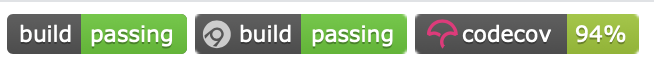
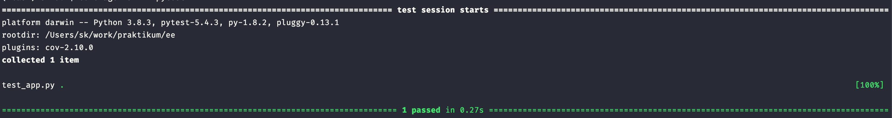
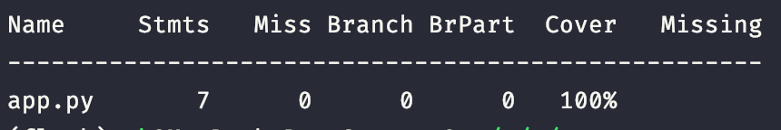
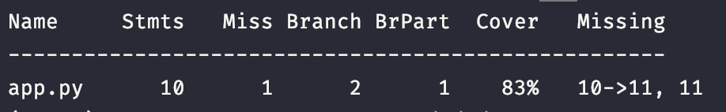
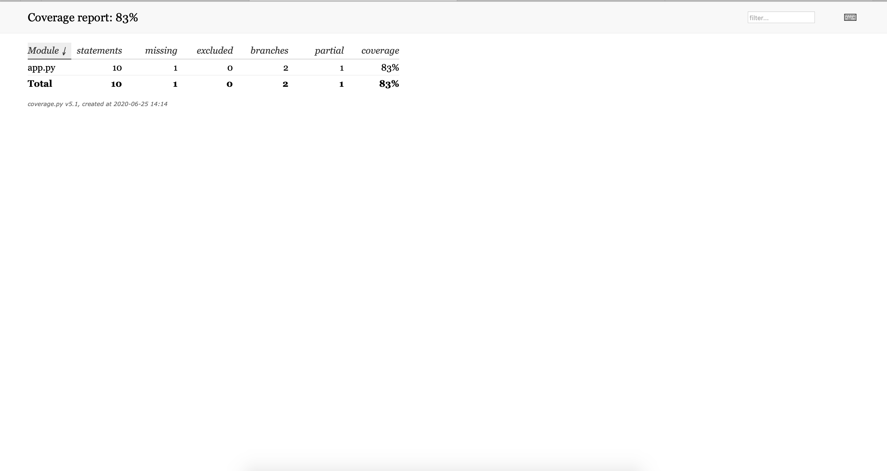
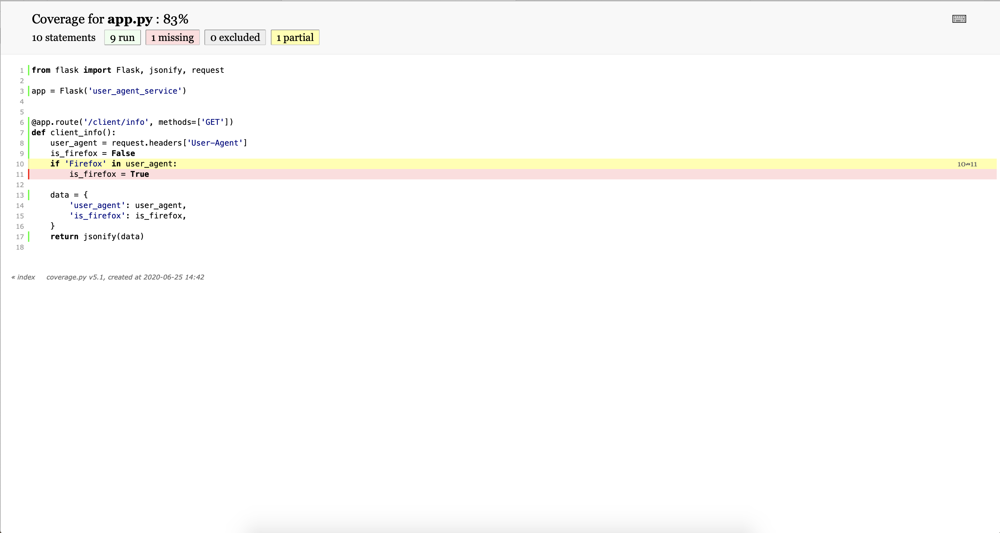
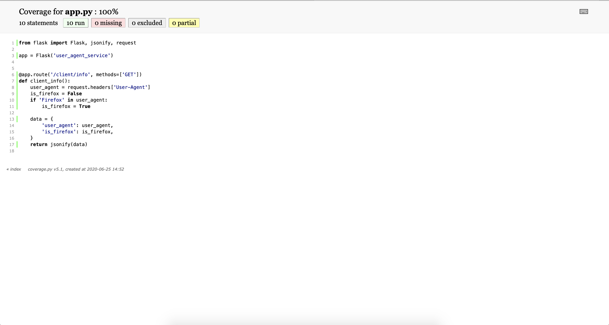
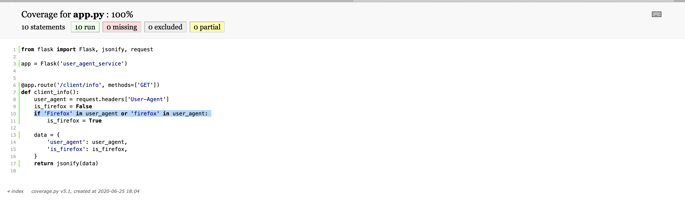

## Покрытие тестами

Один из критериев качества тестов — процент покрытия ими кода. Вы наверняка замечали в некоторых github-репозиториях бейджи codecov. С помощью такого бейджика разработчики библиотек и приложений хотят сообщить, что 94% кодовой базы покрыто тестами.



Coverage помогает разработчикам узнать, все ли функции и ветвления программы (`if ... else ...`) покрыты тестами. Это нужно, чтобы разработчик не забыл написать тесты на ту функциональность, которую он добавил.

Для подключения coverage необходимо установить одноимённый пакет:

```bash
pip install coverage
```

Напишем тесты для вашего небольшого сервиса, который возвращает User-Agent пользователя:

```python
from flask import Flask, jsonify, request

app = Flask('user_agent_service')

@app.route('/client/info', methods=['GET'])
def client_info():
    user_agent = request.headers['User-Agent']
    data = {
        'user_agent': user_agent,
    }
    return jsonify(data)
```

Настройте pytest:

```bash
#setup.cfg
[coverage:run]
branch = True
source =
    app
```

Напишем тест:

```python
# test_app.py
import pytest

from app import app

@pytest.mark.parametrize(
    "user_agent,expected",
    [
        ('testagent/1.0', {'user_agent': 'testagent/1.0'}),

    ],
)
def test_client_info(user_agent, expected):
    client = app.test_client()
    with client:
        resp = client.get(
            '/client/info',
            headers={'User-Agent': user_agent},
        )

        assert resp.json == expected
```

Теперь запустим тестирование:

```bash
coverage run -m pytest
```

После этого вы получите результат:



После прохождения тестов в рабочей директории появится файл `.coverage`, в котором содержится информация о покрытии тестами. 

Давайте выведем статистику в консоль. Выполните команду:

```bash
coverage report -m
```

Вывод будет выглядеть примерно так:



Колонка `Cover` говорит, что файл `[app.py](http://app.py)` полностью покрыт тестами. Изменим код программы, чтобы покрытие было меньше 100%:

```python
from flask import Flask, jsonify, request

app = Flask('user_agent_service')

@app.route('/client/info', methods=['GET'])
def client_info():
    user_agent = request.headers['User-Agent']
    is_firefox = False
    if 'Firefox' in user_agent:
        is_firefox = True

    data = {
        'user_agent': user_agent,
        'is_firefox': is_firefox,
    }
    return jsonify(data)
```

Изменим тесты, потому что изменился формат ответа:

```python
import pytest

from app import app

@pytest.mark.parametrize(
    "user_agent,expected",
    [
        ('testagent/1.0', {'user_agent': 'testagent/1.0', 'is_firefox': False}),
    ],
)
def test_client_info(user_agent, expected):
    client = app.test_client()
    with client:
        resp = client.get(
            '/client/info',
            headers={'User-Agent': user_agent},
        )

        assert resp.json == expected
```

Выполним тесты и выведем отчёт по покрытию:



Теперь покрытие тестами файла `[app.py](http://app.py)` снизилось до 83%. В этом отчёте вы не увидите строчки, которые необходимо покрыть тестами. Для этого выполните команду `coverage html`. После её выполнения в рабочей директории появится htmlcov-директория, в которой находится отчёт в виде HTML-файлов. Откройте в браузере файл `index.html`:



Нажмите на `[app.py](http://app.py)`, чтобы открыть подробную информацию по покрытию:



В файле строка 10 была только частично покрыта, а 11 строка осталась нетронутой во время работы тестов. 

Исправим ситуацию. Добавим тесткейс, который увеличит покрытие тестами:

```bash
import pytest

from app import app

@pytest.mark.parametrize(
    "user_agent,expected",
    [
        ('testagent/1.0', {'user_agent': 'testagent/1.0', 'is_firefox': False}),
        ('Firefox/1.0', {'user_agent': 'Firefox/1.0', 'is_firefox': True}),
    ],
)
def test_client_info(user_agent, expected):
    client = app.test_client()
    with client:
        resp = client.get(
            '/client/info',
            headers={'User-Agent': user_agent},
        )

        assert resp.json == expected
```

Запустим тесты с coverage. Теперь покрытие тестами достигло 100%, а строчки 10 и 11 стали зелёными:



Coverage не идеален — он не может понять, проверены ли все условия внутри `if`. Например, добавим `or` и снова запустим coverage, не меняя тесты:



Уровень покрытия тестами не снизился, а новое условие — не протестировано. Это связано с интерпретатором Python, который использует LL(1)-грамматику и никак не перейдёт на PEG. 

Coverage — не серебреная пуля для написания тестов. Он не придумает за вас тест-сценарии и не расскажет о пограничных условиях. Coverage нужен разработчику, чтобы сигнализировать о тех участках кода, которые остались без тестов.

У многих команд разработчиков есть правило на минимальное покрытие тестами. Если покрытие, например, меньше 80%, то CI не позволит слить мастер в ветку, в которой не хватает тестов. 

CI вам понадобится при разработке микросервисов. С его помощью вы будете запускать тесты, coverage, линтеры и деплой.